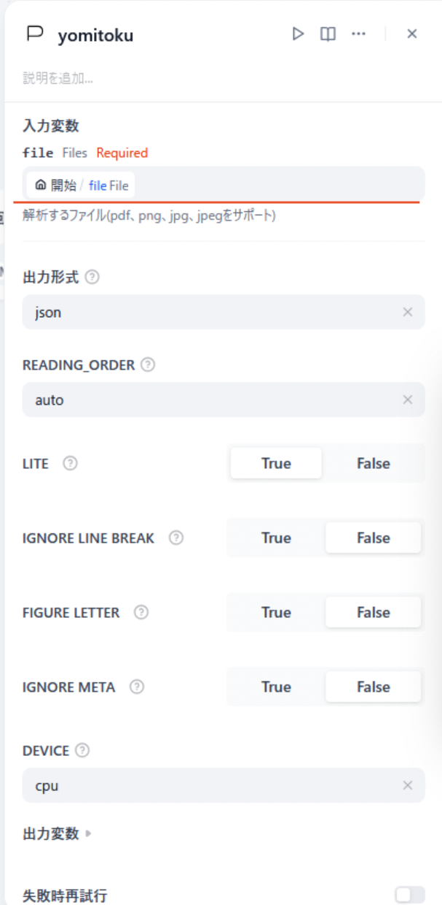

<p class=info>
本プロジェクトは、CTD Networks co.,Ltd によって資金提供され、開発が着手されました
</p>


## 1. 最小システム要件
 - CPU：2Core
 - メモリ：4GB（Macの場合はインストール時8G）


## 2. Difyローカルでの環境構築

1. Dify 1.4.0をcloneします

    ```
    git clone https://github.com/langgenius/dify.git
    cd dify
    git checkout 1.4.0
    ```

2. 移動と.envのコピー

    ```
    cd docker
    sudo cp .env.example .env
    ```


3. pluginの証明チェックをオフにします
 - docker/.envを変更

   ```
   FORCE_VERIFYING_SIGNATURE=false
   ```

4. プラグインに関するタイムアウトの変更（1.4.0）
 - docker/.envを変更

   ```
   PLUGIN_PYTHON_ENV_INIT_TIMEOUT=3600
   PLUGIN_MAX_EXECUTION_TIMEOUT=1800
   ```

   値は環境に合わせてください単位は秒

4. プラグインでファイルを読み取る設定（1.4.0）
  
 - docker/.envを変更
   ```
   FILES_URL=http://api:5001
   ```

5. 実行

    ```
    cd dify/docker
    docker compose up -d
    ```


## 4. Pluginのインストール

1. 「Dify-plugin-YomiToku」リポジトリから```dify-plugin-yomitoku.difypkg```をダウンロードする。  
  場所：```~/dify-plugin-yomitoku/releases/tag/{最新リリースタグ:(2025.5.22時点)0.0.1a}```[🔗]((https://github.com/cshara1/Dify-plugin-YomiToku/releases/tag/0.0.1a))


2. Difyのpluginsページで```dify-plugin-yomitoku.difypkg```をインストールします
 - ```LocalPackageFile（difypkg）```を選択
 - ```dify-plugin-yomitoku.difypkg```をアップロード
 - ```Install from Local Package File```が開始される
<image src="./images/plugin_install.png" />
（インストール完了）


    少し時間がかかりますのでインストールされるまで待ちます<br>
    dify-plugin-daemonコンテナの出力を確認し<br>
    終わらない場合はインターネット環境などを見直してください<br>

        現在時間のかかるプラグインのインストール終了後に一覧に表示されないというバグが見られます<br>
        20分ほど経過して次のような表示がdify-plugin-daemonのコンテナの出力にありましたら<br>
        もう一度difypkgをインストールすると一覧に表示されるようになります<br>


        ```
        [INFO]plugin cshara/yomitoku:0.0.1: Installed tool: yomitoku
        ```
 

## 5. 動作確認

1. Difyのスタジオから"最初から作成"を選択します
 

2. ワークフローを選択し名前を入力して作成します
 
 
3. 開始ノードに入力フィールド,file,単一ファイルを追加します
 
 次のような設定です
 

4. 次のノードにYomiTokuを追加します
 
   ノードの設定をします、前のノードで作成したfileを入力変数に指定します
 
   
5. テスト実行
   ▶️このステップを実行を実行して確認します
 
 


## 6.　出力
"text"にYomiToruから出力されるjsonを出力します